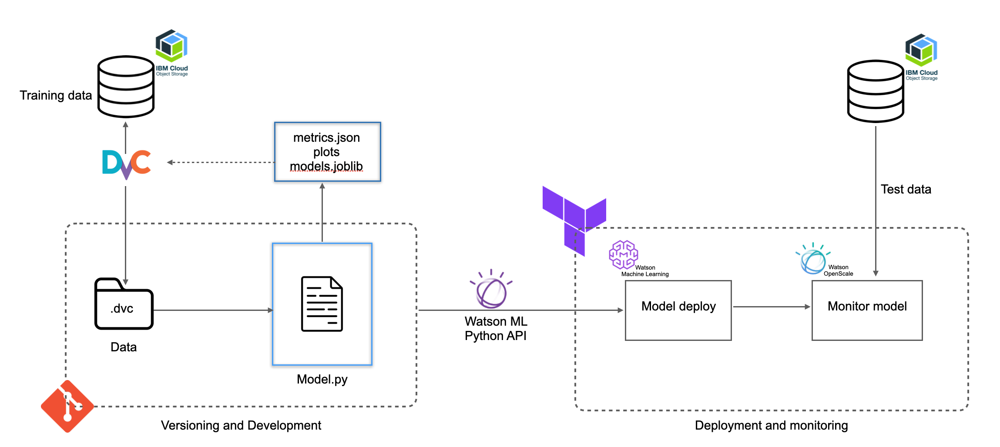
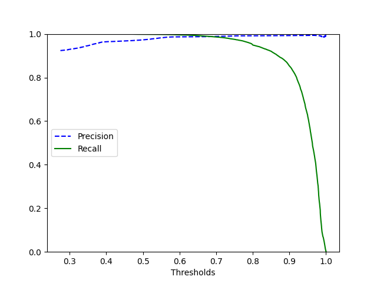
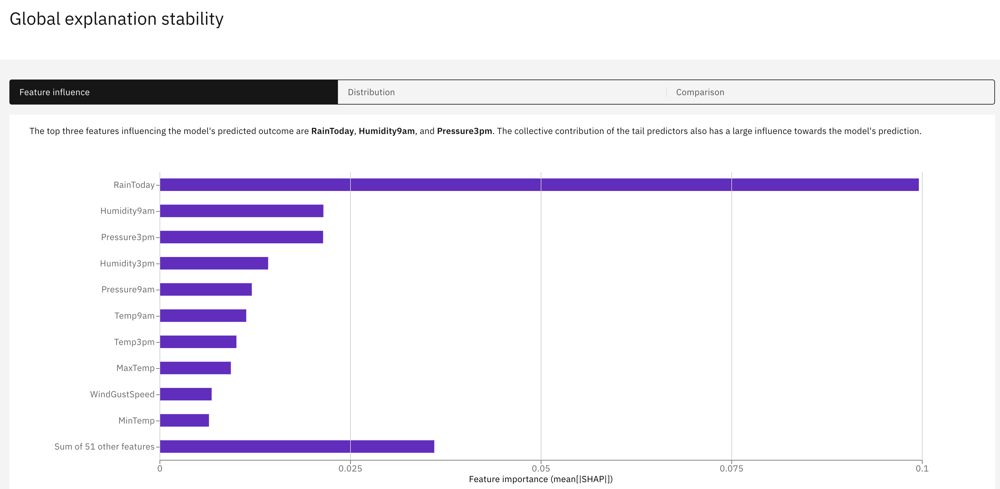

## Deploying weather prediction model on IBM cloud Pak for Data

This repo contains a weather prediction model that is deployed on IBM cloud. The model is a Random Forest classification model that predicts if it will rain tomorrow based on time series data about the past weather conditions. The main aim of this repo is to build an end-to-end ML service that can be deployed on a production-like environment while following MLOps priniciples of versoning, automating, reproducibulity and readability!

Tools used:
- Poetry - Dependency management
- Terraform - setup and manage IBM infrastructure using IaC
- IBM Cloud Object Storage - store data
- GitHub - code versioning
- DVC - data, model and metrics versioning as well as workflow orchestration (dvc repro)
- IBM Watson ML - Deploy ML models
- IBM Watson Openscale - Monitor model performance



## Steps

- Set up poetry environment: Make sure to choose an environment (library versions and python version) that is supported by [IBM cloud software specifications](https://dataplatform.cloud.ibm.com/docs/content/wsj/analyze-data/pm_service_supported_frameworks.html) (I used python 3.9 and scikit learn 1.0.2). The libraries required for this project are all listed (with versions) inside the pyproject.toml file

**`poetry init, poetry add , poetry lock`**

- Create infrastructure on IBM cloud with Terraform: Add an infrastructure folder that contains main.tf (define the resources you need, COS (IBM Cloud Object Storage) and WML (IBM Watson Machine Learning)), terraform.tfvars (contains cloud api key and cloud region), provider.tf (declare variables that store key info). Finally run the following comamnds and it should create your infrastructure

**`terraform init, terraform plan , terraform apply`**

- Create and manage workspace/deployment space on IBM cloud: To create, delete or list deployment spaces and get info about space-id and so forth, the datapak_manage.py file is created. (note: make sure you’ve added ibm cloud api key as an environment variable before you run this file)

```python
python Infrastructure/datapak_manage.py (options)
```

- Configure and authenticate DVC to remote cloud storage on IBM: After you've initialised dvc (dvc init) use the `dvc remote add` to point to your remote storage. The below command sets the url of the remote storage. The *bucket_name* is the name of the bucket you created inside the COS instance. For now just add this as the remote url, I will use `dvc remote modify` to update the urls later. Also take note that `remote-storage` is the name of the allocated remote space on dvc.

`dvc remote add -d remote-storage s3://bucket_name/folder/`

Next, modify the end-point url. You will find this url in IBM cloud> services> COS_ML2 > buckets. 

`dvc remote modify remote-storage endpointurl \ 'https://s3.us-south.cloud-object-storage.appdomain.cloud'`

Next, get HMAC credentials by following [this](https://cloud.ibm.com/docs/cloud-object-storage?topic=cloud-object-storage-uhc-hmac-credentials-main). These steps are essential to authenticate and secure the connection to your cloud account. After following the steps, take note of the storage access key and secret access key and add these to `dvc remote storage` like so:

```python
dvc remote modify --local remote-storage access_key_id "..."
dvc remote modify --local remote-storage secret_access_key "..."
```

Finally, add your data to DVC for tracking:

```python
dvc add data/weatherAUS.csv
```
`dvc add` works the same way `git add` command. The dataset is now under DVC local control and DVC cache(which is by default local but can be configured to be shared). But now, you need to put your data under Git version control with `git add`. Note that DVC created two files named `weatherAUS.csv.dvc` and `.gitignore` in your data folder. These files are responsible for *codifying* your data:

   - weatherAUS.csv.dvc: This file points where your actual data is and every time that your data change, this file changes too.

   - .gitignore: This file won't allow git to upload your data file to your repository. DVC creates automatically so you won't need to worry about it.

These metafiles with `.dvc` extension are YAML files that contain some key-value pair information about your data or model. The *md5* is a very common hash function that takes a file content and produces a string of thirty-two characters. So if you make just a small change in a data file or model controlled by DVC, the md5 hash will be recalculated and that's how your team mates will keep track of what's new in your experiment.

- Build development pipeline using dvc:

```python
dvc repro
```

- Push all data, metrics to the cloud. Save the model within the reports folder. This model will then be deployed onto IBM machine learning service.

```python
dvc push
```
The following is one of the plots pushed to IBM cloud. The plot shows the precison recall graph of the Random Forest Classifier!



- Create workspace/deployment space to deploy our model from the previous step. This creates a deployment space called mlops_project. The environmnet of the deployment space must match the environment of the local development space. If the python version or the scikit-learn version differs, the deployment will fail!

```python
python Infrastructure/datapak_manage.py create mlops_project
```

- Deploy model to the cloud deployment space. Here we pass the model as well as our IBM cloud credentials to authentically deploy the weather prediction model

```python
python src/pipeline/model_deploy_pipeline.py reports/train_pipe.joblib . ./credentials.yaml
```

- You will be able to get the model API from the deployment space. Copy this API into the src/pipeline/test.py file. This file will test the deployed model by sending it live weather data points

- Finally, send data request to deployed model API by running:

```python
python src/pipeline/test.py
```

- If you want to go a step further, you can setup model monitoring using Watson Openscale (note: I manually created an instance of Watson Openscale on IBM cloud). You simply have to feed the deployed model's subscription ID and the deployment space ID to Watson openscale to let it know which model to monitor. In order for Openscale to monitor the performance, you need to send it live data. In my case, I fed a new test data set to openscale using the IBM openscale dasboard. Openscale allows you to monitor drift rate, fairness and basiness as well as feature importance. It also uses explananbulity libraries such as SHAP to explain each prediction. The figure below (Watson openscale dashboard) shows each features' relative weight indicating how strongly they influenced the model’s predicted outcome. Run the following script:

```python
python src/pipeline/openscale.py
```
